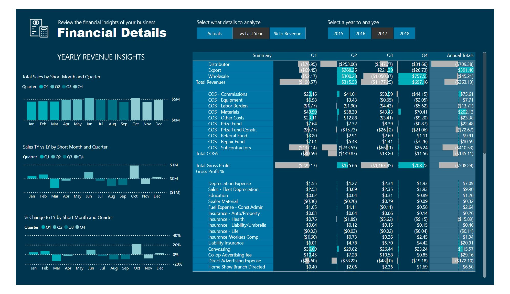

## 📊 Preview

### Navigation

### Income Statement

### Financial Details

### Balance Sheet

### Cash Flow Statement

### Aged Trial Balance

### Revenue Insights

## What this dashboard does
- Consolidates Sales Orders, Customer, Regional, Product, and 
  Company Expense data into a single reporting model
- Custom DAX measures reconcile figures across statements and 
  calculate key financial metrics
- Six interconnected report pages accessible via a central 
  navigation menu

## Files
- `Financial Reporting Dashboard.pbix` — Power BI source file
- `Financial Data.xlsx` — underlying data model
